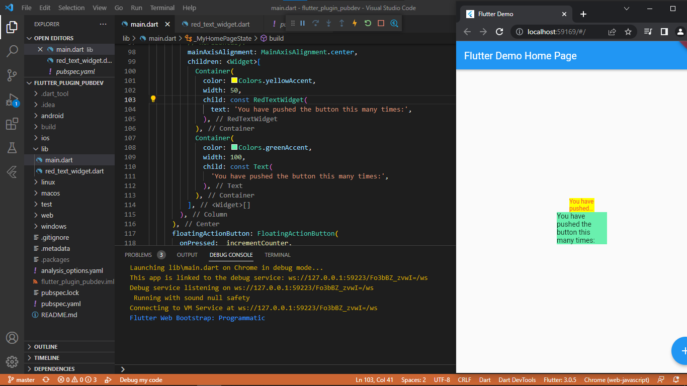

# flutter_plugin_pubdev

Hasil Screenshot praktikum

pada gambar diatas digunakan plugin bernama auto_size_text. dimana plugin ini akan meresize size string sesuai dengan maxlines yang digunakan. bila diperhatikan terdapat dua buat hasil container. container pertama memanggil fungsi red_text_widget yang mana mengharuskan nilai string harus cukup dalam dua baris dengan width yang digunakan oleh karena itu hasilnya ialah string dua baris yang tidak lengkap dikarenakan tidak cukupnya width dan maxlines terhadap string yang diinputkan. sedangkan container kedua tidak menggunakan fungsi red_text_widget oleh karena itu tidak dibatasi dengan maxlines yang mana mengahasilkan seluruh string tertampil sesuai menyesuaikan dengan width nya

## langkah dua
pada langkah dua digunakan perintah flutter "pub add auto_size_text" perintah tersebut berfungsi untuk menambahkan plugin auto_size_text pada project

## langkah lima
pada langkah lima dilakukan finalisasi variabel text dan juga pemanggilan nilai text dari main untuk penggunaan fungsi red_text_widget

## langkah enam
pada langkah enam dilakukan penambahan dua container pada class _MyHomePageState kedua container tersebut digunakan sebagai pembeda antara penggunaan fungsi red_text_widget dan tanpa fungsi.

## penjelasan parameter
key = Mengontrol bagaimana satu widget menggantikan widget lain pada tree.
textKey = Mengatur key untuk widget Teks yang dihasilkan
style = Jika non-null, maka style digunakan untuk teks ini
minFontSize = Batasan ukuran teks minimum yang akan digunakan saat mengubah ukuran teks secara otomatis (Diabaikan jika presetFontSizes diatur)
maxFontSize =  Batasan ukuran teks maksimum yang akan digunakan saat mengubah ukuran teks secara otomatis (Diabaikan jika presetFontSizes diatur)
stepGranularity = Ukuran step dimana ukuran font sedang disesuaikan dengan batasan.
presetFontSizes = Mendefinisikan semua ukuran font yang mungkin
group = Menyinkronkan ukuran beberapa AutoSizeText
textAlign = Bagaimana teks harus disejajarkan secara horizontal
textDirection = memutuskan bagaimana nilai textAlign seperti TextAlign.start dan TextAlign.end diinterpretasikan
locale = Digunakan untuk memilih font ketika karakter Unicode yang sama dapat dirender secara berbeda, tergantung pada lokal
softWrap = Apakah teks harus putus pada jeda baris lunak
wrapWords = Apakah kata-kata yang tidak cocok dalam satu baris harus dibungkus. Default ke true untuk berperilaku seperti Teks
overflow = Bagaimana visual overflow harus ditangani
overflowReplacement = Jika teks meluap dan tidak sesuai dengan batasnya, widget ini akan ditampilkan sebagai gantinya
textScaleFactor = Jumlah piksel font untuk setiap piksel logis. Juga memengaruhi minFontSize, maxFontSize, dan presetFontSizes
maxLines = Jumlah maksimum baris opsional untuk teks yang akan dibentangkan
semanticsLabel = Label semantik alternatif untuk teks ini